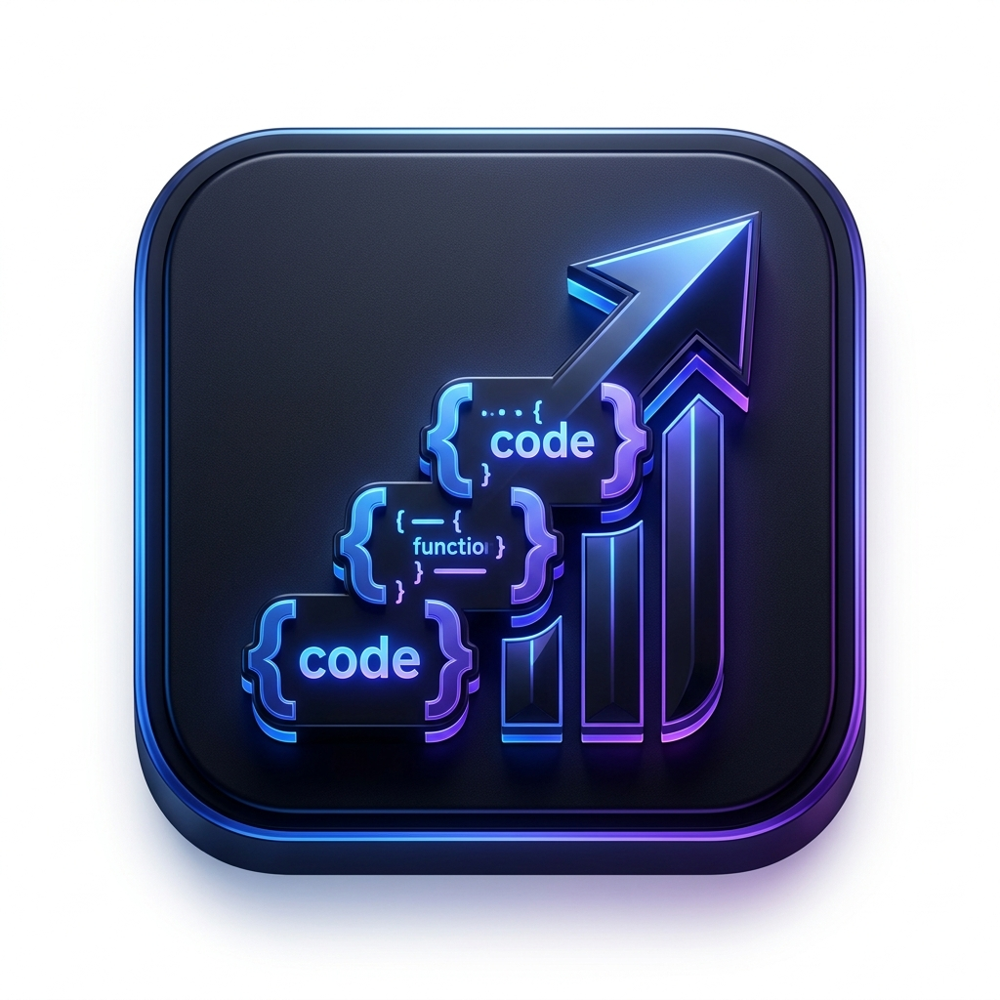

# 🚀 Placement Grind

**Master the Grind. Secure the Offer.**

Placement Grind is a premium, offline-first Flutter application designed specifically for Computer Science students to streamline their campus placement preparation. It helps you track daily tasks, manage XP, level up your skills, and stay motivated throughout the journey.



## ✨ Features

- **📊 Dynamic Dashboard:** Get an overview of your progress, current level, and daily streaks.
- **✅ Task Management:** Organize your daily coding problems, subjects, and mock interviews with ease.
- **📈 Progress Tracking:** Visualize your growth with interactive charts (XP and Leveling system).
- **🔥 Motivation Hub:** Daily quotes and milestones to keep you pushing forward.
- **📱 Premium Dark UI:** A sleek, modern interface optimized for focus and long study sessions.
- **💾 Offline First:** Your data stays on your device using local persistence.

## 🛠️ Tech Stack

- **Framework:** [Flutter](https://flutter.dev/)
- **Language:** [Dart](https://dart.dev/)
- **Persistence:** `shared_preferences`
- **Charts:** `fl_chart`
- **Styling:** `google_fonts` (Outfit/Inter)
- **UI Components:** `flutter_slidable`

## 🚀 Getting Started

To get a local copy up and running, follow these simple steps:

### Prerequisites
- Flutter SDK installed
- Android Studio / VS Code with Flutter extensions

### Installation
1. Clone the repo
   ```sh
   git clone https://github.com/yashmakwana03/placement-grind.git
   ```
2. Install dependencies
   ```sh
   flutter pub get
   ```
3. Run the app
   ```sh
   flutter run
   ```

## 📸 Screenshots
*(Add your app screenshots here!)*

## 📄 License
Distributed under the MIT License. See `LICENSE` for more information.

---
Created with ❤️ by [Yash Makwana](https://github.com/yashmakwana03)
